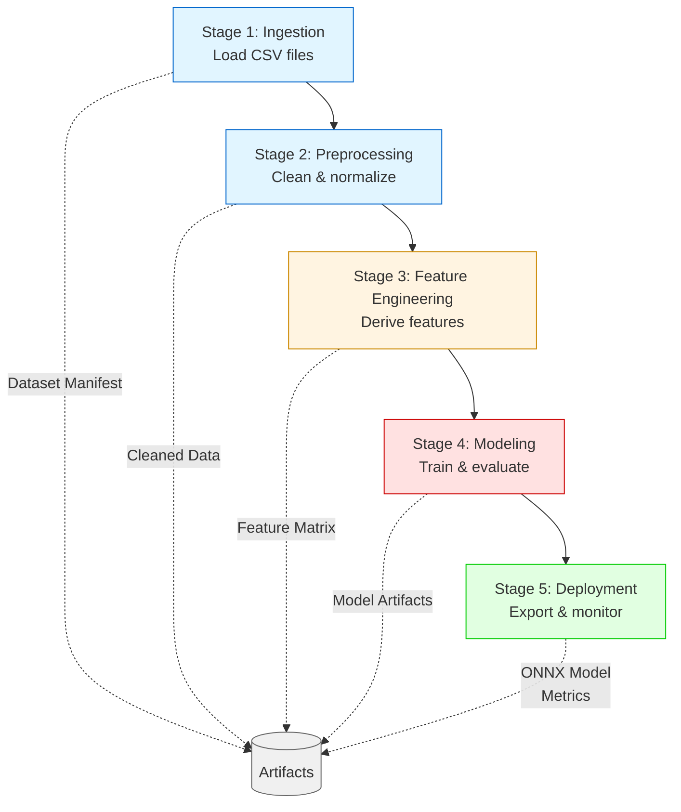

## Overview

The Hospital Data Analysis Platform implements a **five-stage pipeline design** that processes data through distinct phases. Each stage has clear inputs, outputs, and failure modes, enabling better debugging and maintainability.

## Stage Flow



## Stage 1: Ingestion

### Purpose

Load raw hospital data from multiple CSV sources and create a unified dataset manifest.

### Location

`task/ingestion/`

### Key Functions

<CodeGroup>
```python loader.py
def load_hospital_data(data_dir: Path) -> dict[str, pd.DataFrame]:
    """Load data from general, prenatal, and sports hospital departments."""
    datasets = {}
    for hospital, file_name in HOSPITAL_FILES.items():
        path = data_dir / file_name
        datasets[hospital] = pd.read_csv(path)
    return datasets

def merge_hospital_data(datasets: dict[str, pd.DataFrame]) -> pd.DataFrame:
    """Align column schemas and concatenate all hospital datasets."""
    general_columns = datasets["general"].columns
    aligned = []
    for _, frame in datasets.items():
        local = frame.copy()
        local.columns = general_columns
        aligned.append(local)
    merged = pd.concat(aligned, ignore_index=True)
    return merged
```

```python versioning.py
def create_dataset_manifest(data_dir: Path, output_path: Path) -> dict:
    """Generate manifest with file metadata for reproducibility."""
    # Creates JSON manifest with file sizes, modification times, checksums
```
</CodeGroup>

### Inputs

- `general.csv` - General hospital department data
- `prenatal.csv` - Prenatal department data
- `sports.csv` - Sports medicine department data

### Outputs

- Merged DataFrame with unified schema
- Dataset manifest JSON (for versioning)

### Failure Modes

- Missing or malformed CSV files
- Schema drift between hospital sources
- Missing expected columns

### CLI Command

```bash
python cli.py manifest
```

## Stage 2: Preprocessing

### Purpose

Clean raw data, normalize categorical values, and handle missing data according to domain-specific rules.

### Location

`task/preprocessing/cleaning.py`

### Key Operations

```python
def clean_hospital_data(df: pd.DataFrame) -> pd.DataFrame:
    clean = df.copy()
    
    # 1. Gender normalization
    clean["gender"] = clean["gender"].replace({
        "male": "m", "female": "f", 
        "man": "m", "woman": "f"
    })
    clean["gender"] = clean["gender"].fillna("f")
    
    # 2. Numeric column imputation
    clean[NUMERIC_FILL_COLUMNS] = clean[NUMERIC_FILL_COLUMNS].fillna(0)
    
    # 3. Test result normalization
    for col in TEST_COLUMNS:
        clean[col] = clean[col].fillna("unknown")
    
    # 4. Diagnosis normalization
    clean["diagnosis"] = clean["diagnosis"].fillna("unknown")
    
    # 5. Type coercion with error handling
    for col in ["age", "height", "weight", "bmi", "children", "months"]:
        clean[col] = pd.to_numeric(clean[col], errors="coerce").fillna(0)
    
    return clean
```

### Data Quality Rules

| Column Type | Missing Value Strategy |
|------------|------------------------|
| Numeric (bmi, children, months) | Fill with 0 |
| Test results (blood_test, ecg, etc.) | Fill with "unknown" |
| Diagnosis | Fill with "unknown" |
| Gender | Fill with "f" (default) |

### Inputs

- Raw merged DataFrame from ingestion

### Outputs

- Cleaned DataFrame with consistent types and no missing values

### Failure Modes

- Unexpected categorical values
- Extreme outliers in numeric columns
- Column type mismatches

## Stage 3: Feature Engineering

### Purpose

Construct derived features from raw columns to improve predictive power and enable risk stratification.

### Location

`task/feature_engineering/features.py`

### Feature Derivations

<Tabs>
  <Tab title="Age Features">
    ```python
    AGE_BINS = [0, 15, 35, 55, 70, 80]
    AGE_LABELS = ["0-15", "15-35", "35-55", "55-70", "70-80"]
    
    feat["age_range"] = pd.cut(feat["age"], bins=AGE_BINS, labels=AGE_LABELS)
    feat["is_adult"] = (feat["age"] >= 18).astype(int)
    ```
    
    Creates categorical age bands and binary adult indicator.
  </Tab>
  
  <Tab title="BMI Risk">
    ```python
    feat["bmi_risk"] = pd.cut(
        feat["bmi"], 
        bins=[-1, 18.5, 25, 30, 100], 
        labels=[0, 1, 2, 3]
    ).astype(float)
    ```
    
    Maps BMI to risk levels:
    - 0: Underweight (< 18.5)
    - 1: Normal (18.5-25)
    - 2: Overweight (25-30)
    - 3: Obese (> 30)
  </Tab>
</Tabs>

### Inputs

- Cleaned DataFrame from preprocessing

### Outputs

- Enhanced DataFrame with derived features

### Failure Modes

- Binning errors from extreme values
- Type conversion failures

## Stage 4: Modeling

### Purpose

Train predictive models for risk and outcome prediction, evaluate performance, and detect anomalies.

### Location

`task/modeling/` and `task/anomaly_detection/`

### Model Architecture

The platform uses a custom **SimpleLogisticModel** optimized for CPU execution:

```python modeling/predictive.py
class SimpleLogisticModel:
    def __init__(self, lr: float = 0.01, epochs: int = 600):
        self.lr = lr
        self.epochs = epochs
        self.weights = None
    
    def fit(self, X: pd.DataFrame, y: pd.Series):
        """Gradient descent training with sigmoid activation."""
        x = X.values.astype(float)
        yv = y.values.astype(float)
        self.weights = np.zeros(x.shape[1] + 1)
        
        for _ in range(self.epochs):
            logits = x @ self.weights[1:] + self.weights[0]
            preds = self._sigmoid(logits)
            err = preds - yv
            # Gradient updates
            self.weights[0] -= self.lr * err.mean()
            self.weights[1:] -= self.lr * (x.T @ err) / len(x)
        return self
```

### Training Pipeline

1. **Feature preparation**: Normalize numeric features, one-hot encode categoricals
2. **Target construction**: 
   - Risk target: Binary indicator for high-risk diagnoses (appendicitis, pregnancy)
   - Outcome target: Positive blood test results
3. **Train/test split**: 75/25 with random shuffling (seed=42)
4. **Model training**: Separate models for risk and outcome prediction
5. **Evaluation**: Accuracy, F1 score, and AUC-ROC for both models

### Anomaly Detection

```python
detector = OutlierDetector(random_state=42).fit(features)
anomalies = detector.detect(features)

# Early warning simulation
early_warning = simulate_early_warning(
    anomalies["anomaly_score"], 
    timestamps, 
    threshold=anomalies["anomaly_score"].quantile(0.9)
)
```

### Inputs

- Feature matrix from feature engineering
- Configuration parameters (seed, test_size, feature_columns)

### Outputs

- `ModelArtifacts` containing:
  - Trained risk and outcome models
  - Test set splits (X_test, y_risk_test, y_outcome_test)
- Performance metrics (accuracy, F1, AUC)
- Anomaly scores and early warning alerts

### Failure Modes

- Convergence issues with extreme learning rates
- Class imbalance leading to poor F1 scores
- High false-positive rates in anomaly detection

## Stage 5: Deployment

### Purpose

Export models for production inference, benchmark performance, and establish monitoring infrastructure.

### Location

`task/deployment/` and `task/evaluation/`

### Key Components

<AccordionGroup>
  <Accordion title="CPU Inference">
    ```python deployment/cpu_inference.py
    def run_cpu_inference(model, X: pd.DataFrame) -> dict[str, float]:
        start = time.perf_counter()
        probs = model.predict_proba(X)[:, 1]
        elapsed_ms = (time.perf_counter() - start) * 1000
        return {
            "inference_latency_ms": elapsed_ms,
            "output_mean_probability": float(probs.mean()),
            "output_std_probability": float(probs.std()),
        }
    ```
    
    Measures actual CPU inference latency and output statistics.
  </Accordion>
  
  <Accordion title="ONNX Export">
    ```python
    export_pipeline_to_onnx(
        model=artifacts.risk_model,
        output_path=CONFIG.output_dir / "risk_model.onnx",
        n_features=len(CONFIG.feature_columns)
    )
    ```
    
    Converts trained models to ONNX format for cross-platform deployment.
  </Accordion>
  
  <Accordion title="Monitoring Summary">
    ```python
    monitoring = build_monitoring_summary(
        alert_flags=(risk_frame["risk_band"] == "high").astype(int),
        risk_probabilities=risk_frame["risk_probability"],
        stream_latency_ms_per_row=stream_stats["stream_latency_ms_per_row"],
    )
    ```
    
    Generates operational metrics for reliability monitoring.
  </Accordion>
</AccordionGroup>

### Benchmarking

The platform runs repeated benchmarks to account for system noise:

```python
bench = run_repeated_benchmark(
    lambda: evaluate_predictive_models(artifacts),
    metric_key="risk_accuracy",
    runs=CONFIG.benchmark_runs,
    confidence=CONFIG.confidence_level,
)
```

### Inputs

- Trained model artifacts
- Test dataset
- Benchmark configuration

### Outputs

- ONNX model file
- Inference latency statistics
- Monitoring summary JSON
- Benchmark results with confidence intervals
- Hardware profile tables

### Failure Modes

- ONNX export failures for unsupported operators
- Latency spikes from CPU contention
- Serialization format mismatches

## Pipeline Execution

### Full Pipeline

Run all stages sequentially:

```bash
cd "Data Analysis for Hospitals/task"
python cli.py run
```

### Early Warning Experiment

Run hardware-constrained early warning experiments:

```bash
python cli.py early-warning-experiment
```

This executes all pipeline stages with multiple hardware constraint scenarios.

## Stage Isolation Benefits

<CardGroup cols={2}>
  <Card title="Debuggability" icon="bug">
    Each stage can be tested independently with known inputs
  </Card>
  <Card title="Restartability" icon="rotate-right">
    Failed stages can be rerun without repeating earlier work
  </Card>
  <Card title="Failure Isolation" icon="shield">
    Data quality issues don't cascade into model quality issues
  </Card>
  <Card title="Incremental Validation" icon="check">
    Outputs can be validated at each stage boundary
  </Card>
</CardGroup>

## Next Steps

<Card title="Hardware Constraints" icon="microchip" href="/concepts/hardware-constraints">
  Learn how the pipeline adapts to memory and compute limitations
</Card>